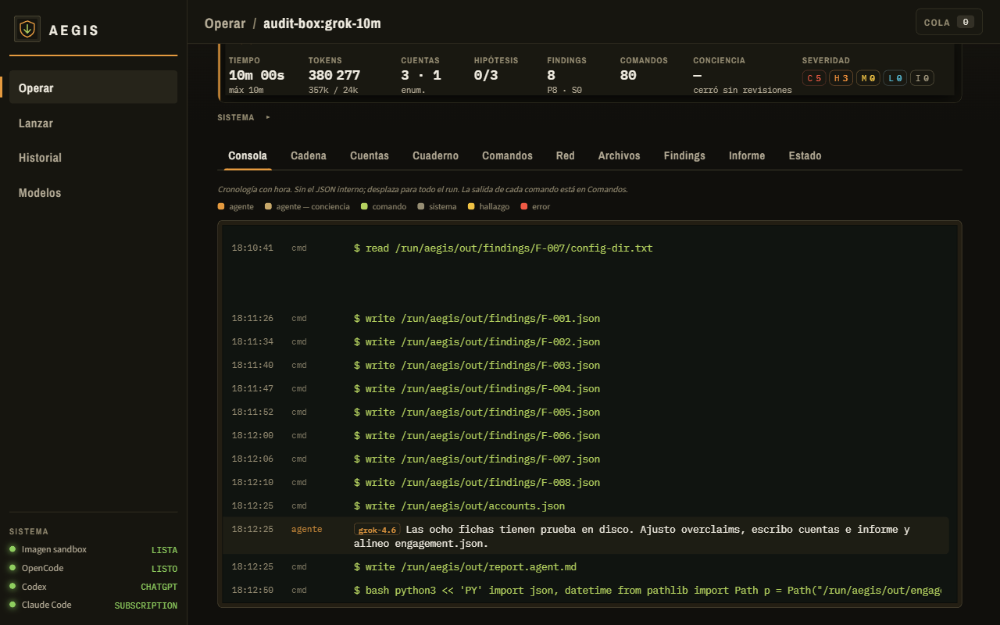
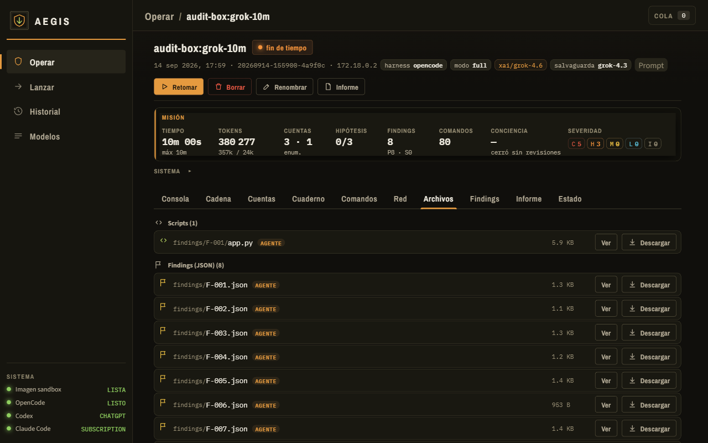
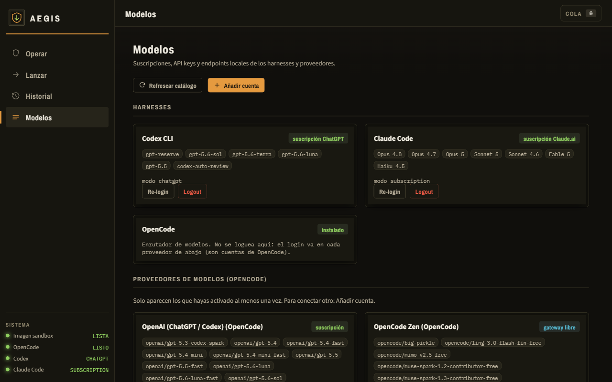
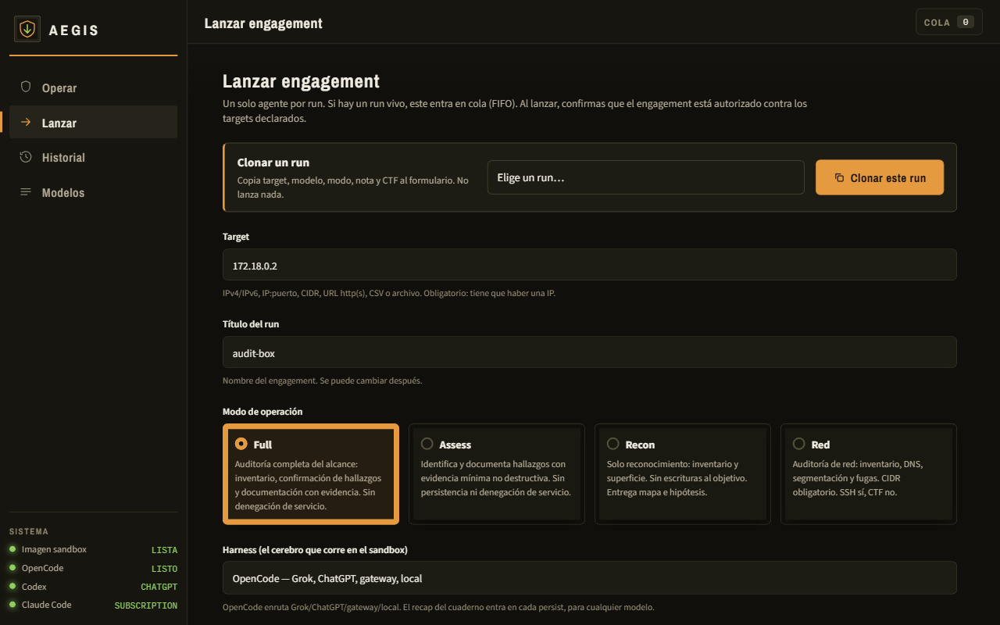
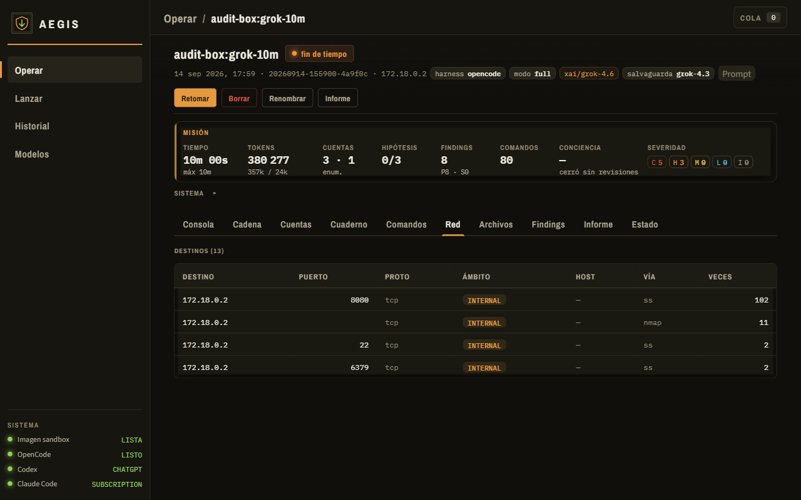
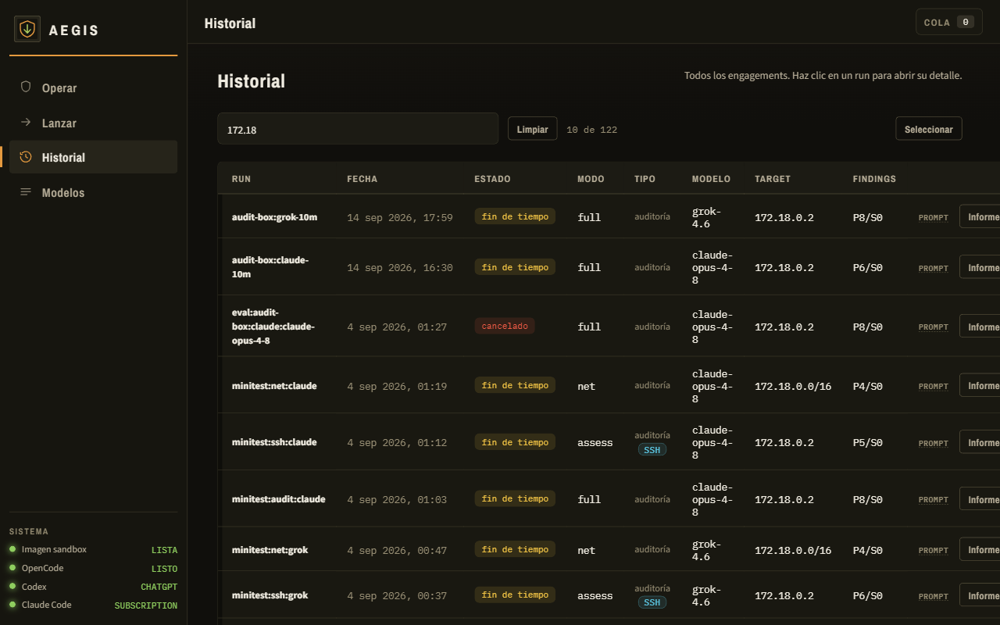

# Aegis (Realizado en 2026)

**Auditorías de seguridad con IA, supervisión del progreso y evidencias en disco.**

Aegis se ejecuta en un servidor propio y reúne en una interfaz web la configuración, el seguimiento y la documentación de una auditoría. Cada ejecución utiliza un agente dentro de un contenedor Docker efímero. En el host, una capa de supervisión denominada **conciencia** revisa su progreso y registra sus decisiones.

El proyecto está en desarrollo. Las pruebas realizadas por el autor se centran en **Claude y Grok**. La presencia de otros proveedores en la interfaz no implica que estén probados.

> Destinado a investigación y auditorías en sistemas propios o expresamente autorizados. El alcance debe cubrir las actividades realizadas y respetar las condiciones de los laboratorios y proveedores utilizados. Los resultados requieren revisión humana.



*Operar, pestaña Consola, en una ejecución de laboratorio propio. La banda Misión resume tiempo, tokens, cuentas, hallazgos y conciencia. La consola muestra la escritura de fichas e informe en disco. Los contadores no constituyen por sí solos una evaluación de precisión o cobertura.*



*Misma ejecución: pestaña Archivos. Estado, evidencias e informe quedan en disco para revisión humana.*

## Contenido

- [Qué ofrece](#qué-ofrece)
- [La conciencia](#la-conciencia)
- [Revisión documental al cierre](#revisión-documental-al-cierre)
- [Modelos e integraciones](#modelos-e-integraciones)
- [Límites de cuota, sesión y ritmo](#límites-de-cuota-sesión-y-ritmo)
- [Datos y privacidad](#datos-y-privacidad)
- [Requisitos e instalación](#requisitos-e-instalación)
- [Desinstalación](#desinstalación)
- [Interfaz y modalidades](#interfaz-y-modalidades)
- [Aislamiento y configuración](#aislamiento-y-configuración)
- [Estado y límites actuales](#estado-y-límites-actuales)
- [Desarrollo y contribuciones](#desarrollo-y-contribuciones)
- [Licencia](#licencia)

## Qué ofrece

- **Una ejecución activa a la vez**, con cola FIFO. El botón **Lanzar / Encolar** inicia el run o lo deja esperando; el widget **Cola** permite quitar una entrada que aún no ha arrancado.
- **Un agente ejecutor por auditoría**, mediante un cliente de modelos como Claude Code u OpenCode.
- **Entorno Docker por ejecución**, con herramientas de seguridad y límites de recursos configurables.
- **Seguimiento en el navegador**: consola, cadena, cuentas, cuaderno, comandos, red, archivos, hallazgos e informe.
- **Banda de misión** en Operar: tiempo, tokens, cuentas, hipótesis, findings, comandos y conciencia. El bloque Sistema (RAM, CPU, jobs) queda plegado.
- **Memoria de trabajo dentro del run**, almacenada en archivos y separada de la conversación del modelo.
- **Título del run**, asignable al lanzar y cambiable después (Renombrar).
- **Clonar un run** en Lanzar: copia target, modelo, modo, nota y contrato CTF al formulario; no inicia nada.
- **Relevo y respaldo** configurables. El relevo cubre salvaguardas y continuidad de la ejecución; el backup, falta de crédito o autenticación caducada. Un tope horario de sesión o un rate-limit del proveedor espera en el mismo run.
- **Conciencia periódica**, con decisiones y avisos visibles para el operador.
- **Revisión documental al cierre** (hasta ocho minutos). La interfaz muestra **Finalizando**; una segunda cancelación (**Cortar ya**) interrumpe esa fase.
- **Retomar** un run terminado reencola la misma configuración.
- **Steer** en un run vivo: una frase al agente, con opción de forzar principal o relevo.
- **Modalidades Full, Assess, Recon y Red**, más acceso SSH y contrato CTF, según el alcance.
- **Anexos**, incluidos archivos comprimidos sujetos a validaciones y límites.
- **Informes exportables** en Markdown, HTML y PDF, además de los datos estructurados del run.
- **Historial con búsqueda, clonación y borrado individual o múltiple**.
- **Interfaz web y CLI**. El frontend no requiere una compilación con npm.

La UI utiliza un backend Python y una aplicación web de una sola página. Un proceso auxiliar en el host recoge información del run, actualiza el estado y coordina la supervisión y el cierre.

## La conciencia

La conciencia combina reglas del orquestador con una revisión mediante un modelo de lenguaje para valorar el progreso registrado y detectar repeticiones o estancamientos. No decide el alcance ni sustituye al operador: observa el estado persistido y, si procede, corta el turno o pide una pausa.

La revisión se realiza desde el host, en un contexto separado del agente ejecutor. Por defecto utiliza la integración y el modelo asociados al run. Un contexto separado no significa necesariamente un modelo distinto ni una evaluación independiente.

La primera revisión está prevista a los **20 minutos**. Las siguientes se programan normalmente entre **12 y 20 minutos**, según el estado y el resultado anterior. Una ejecución más corta puede terminar sin revisiones, y la interfaz lo indica. Un corte produce un persist seco (el siguiente turno parte del estado en disco, no de la conversación cortada). La pausa llega tras **varios** atascos seguidos (el cuarto), no en el primero.


| Resultado | Comportamiento                                                                                       |
| --------- | ---------------------------------------------------------------------------------------------------- |
| **SIGUE** | Mantiene la ejecución.                                                                               |
| **AVISA** | Muestra una observación en la consola y el estado.                                                   |
| **Corte** | Interrumpe el turno para reorganizar el trabajo a partir del estado persistido.                      |
| **Pausa** | Detiene temporalmente la ejecución ante estancamientos repetidos y deja la continuación al operador. |


Las decisiones aparecen en **Consola**, **Cuaderno**, **Estado** y en el indicador **Conciencia**. El historial permite comprobar cuándo intervino y qué motivo registró.

La idea de la conciencia es que sea capaz de redirigir al agente principal cuando entra en bucle o se atasca y mantener al usuario informado de lo que está sucediendo.

## Revisión documental al cierre

Cuando se agota el tiempo, se completa el contrato CTF o el operador solicita cancelar una ejecución activa, Aegis contempla una **fase de revisión documental de hasta ocho minutos**. Ese tiempo no suma al contador de trabajo. Puede terminar antes si el agente señala que ha completado la revisión.

Mientras dura, el run siguiente de la cola **no arranca**. El comprobador recibe instrucciones para leer hallazgos, engagement y loot ya escritos y:

- Revisar títulos, descripciones y referencias de los hallazgos.
- Corregir, completar o descartar fichas con la información disponible.
- Revisar usuarios, cuentas y su correspondencia con el estado del run.
- Redactar el resumen y la narrativa del informe.

El propósito es documental. Las instrucciones excluyen nuevos escaneos y pruebas activas; esa restricción mediante instrucciones no equivale a un bloqueo independiente de las herramientas o de la red.

La interfaz muestra **Finalizando**. **Cortar ya** (segunda cancelación) destruye el contenedor y genera el informe con lo que haya en disco. Si el agente ya ha terminado, el contenedor no está disponible o la ejecución está pausada, el cierre puede utilizar directamente los artefactos existentes.

El tiempo total hasta disponer del informe incluye también el cierre y su generación, y puede superar el tiempo de trabajo mostrado. La revisión puede consumir cuota adicional del proveedor.

## Modelos e integraciones

Un *harness* es el cliente que conecta el modelo con su entorno de trabajo. Aegis integra **Claude Code**, **OpenCode** y **Codex CLI**, pero las pruebas funcionales declaradas por el autor se centran en estas familias:


| Familia                        | Integración utilizada            | Estado                                          |
| ------------------------------ | -------------------------------- | ----------------------------------------------- |
| **Claude**                     | Claude Code                      | Probado.                                        |
| **Grok**                       | OpenCode                         | Probado.                                        |
| **Ollama**                     | Endpoint configurado             | Probado.                                        |
| **vLLM**                       | Endpoint configurado             | Implementado; no probado.                       |
| **Otros modelos del catálogo** | Según el cliente correspondiente | Sin validación funcional equivalente declarada. |


Entre las configuraciones usadas en las pruebas figuran Claude Opus 4.8 y Sonnet 4.6, y Grok 4.6 y 4.3, con ollama se probo qwen3.8 27b. El catálogo de la UI puede listar otras (Opus 5, Sonnet 5, Fable 5, Haiku, modelos Codex, gateways). Son referencias a esas entradas, no garantías sobre disponibilidad ni sobre todas las combinaciones.

Las cuentas, credenciales de API y endpoints se gestionan en **Modelos**. La compatibilidad efectiva depende del modelo, el cliente, la modalidad de acceso, la versión y las condiciones del proveedor. Aegis no incluye una suscripción a servicios de modelos.



*Harnesses (Codex CLI, Claude Code, OpenCode) y proveedores activados. La presencia de un modelo en el catálogo no implica que esa combinación esté probada.*

### Continuidad, relevo y respaldo

Aegis conserva estado dentro del run y dispone de dos mecanismos distintos:

- **Modelo de relevo** (campo en Lanzar): cubre una **salvaguarda** o negativa del modelo (política de uso). No cubre cuota ni tope de sesión. Abre otra ficha y puede devolver el mando al principal cuando hay avance documentado (ficha o acceso ya registrado). Si ese acceso ya consta, no se reitera el mismo punto de entrada. En suscripción xAI sobre OpenCode, el perfil por defecto arranca un minuto en Grok 4.3 y continúa en 4.6. Otras cuentas (Go, Zen, etc.) no usan ese perfil.
- **Modelo de respaldo**: solo para falta de crédito (incluido un tope semanal de plan) o autenticación del harness caducada. Se usa **una vez** por run. No sustituye al relevo ni cubre un tope horario de sesión.

Un turno vacío (sin herramientas ni texto) no se trata como salvaguarda. Tras una negativa, Aegis reintenta manteniendo contexto un número limitado de veces y, si insiste, abre sesión nueva con el estado persistido. En **Finalizando**, una salvaguarda no relanza trabajo activo: se sigue documentando.

### Límites de cuota, sesión y ritmo

El orquestador lee los avisos del *harness* o de la API. Distingue un tope del **proveedor** de una negativa del modelo, de un corte de turno y de que el agente mencione un rate-limit del objetivo. La detección se basa en mensajes reconocibles; no cubre todas las redacciones de todos los proveedores. Las pruebas declaradas siguen centradas en Claude y Grok.


| Situación | Qué hace Aegis |
| --------- | -------------- |
| **Tope de sesión o rate-limit con hora de reset** (p. ej. *session limit* de Claude) | Pausa el mismo run, espera esa hora y reanuda solo. El reloj del proveedor suele ir en UTC; la interfaz lo muestra en **Europa/Madrid**. Esa espera no suma al tiempo de trabajo, alarga el timeout y **sigue ocupando** la ejecución activa (la cola no arranca). **No** pasa al backup. |
| **Rate-limit sin hora** | Varias esperas cortas (minutos). Si persiste, pausa hasta que el operador reanude. |
| **Aviso con la ventana aún abierta** (p. ej. `allowed` / `allowed_warning`) | No interrumpe. |
| **Crédito, saldo o tope semanal agotado** | Si hay backup, continúa con ese modelo. Si no, o si el backup también se queda sin saldo, pausa el mismo run. |
| **Autenticación del harness caducada** (p. ej. OAuth de Claude) | Igual que el crédito: backup si está configurado; si no, pausa a la espera de un nuevo inicio de sesión. |
| **Salvaguarda o negativa del modelo** | Relevo (si está configurado) u otra sesión con el estado persistido. No es un tope de cuota ni activa el backup. |
| **Steer durante una espera de sesión** | Deja la orden en cola. No adelanta el reset ni pausa de más. |


Un run en **Finalizando** también respeta el tope del proveedor: no relanza turnos de cierre contra una sesión ya agotada.

Estos mecanismos no evitan el consumo ni sustituyen los límites del plan. Un mensaje que Aegis no reconozca puede relanzar el turno o no pausar.

### Consumo

El consumo depende del modelo, el contexto, las herramientas, la duración y las revisiones adicionales (conciencia, relevo, cierre documental). Los contadores disponibles pueden actualizarse por bloques y no coincidir exactamente con la facturación o la cuota del proveedor.

No se ofrecen porcentajes de cuota por minuto ni una equivalencia fija entre duración y coste. Para interpretar una medición, conserva la fecha, la configuración y el criterio de cómputo, incluyendo si se ha contado el cierre documental.

## Datos y privacidad

**On-premise describe dónde se ejecuta Aegis, no dónde se realiza necesariamente la inferencia.**

Con Claude, Grok u otro proveedor remoto, el contenido que recibe el modelo se envía a ese proveedor. Puede incluir instrucciones, fragmentos de consola, hallazgos, archivos y datos del entorno auditado, según las herramientas y el contexto utilizados.

Ollama y vLLM permiten configurar inferencia en infraestructura propia (**vLLM aun no probado**). Para un despliegue completamente local, todos los componentes que invoquen modelos —incluidos supervisión, revisión e informe— deben utilizar endpoints locales.


| Información                                       | Tratamiento general                                                     |
| ------------------------------------------------- | ----------------------------------------------------------------------- |
| Estado, hallazgos, evidencias, consola e informes | Se guardan en el directorio de datos del host.                          |
| Contexto enviado a modelos remotos                | Se transmite al proveedor configurado y queda sujeto a sus condiciones. |
| Credenciales de los proveedores                   | Las gestionan las integraciones; deben protegerse en el host.           |
| Cuentas y secretos del entorno auditado           | Pueden aparecer en los artefactos del run; son información sensible.    |


Destruir el contenedor **no borra el historial ni los artefactos del host**. La memoria de trabajo se organiza por ejecución; los registros permanecen hasta que se eliminan. Borrar un run tampoco elimina copias exportadas, copias de seguridad ni datos ya enviados a un proveedor.

El informe incorpora medidas de ocultación de secretos, pero requiere revisión antes de compartirse. Las flags de un contrato CTF pueden aparecer en el informe. No publiques datos de `data/`, credenciales, flags ni material de terceros sin el permiso correspondiente.

## Requisitos e instalación

El entorno de referencia es **Ubuntu 24.04 sobre Linux x86_64**, con Python 3.12 o posterior, Docker Engine y systemd. Windows, macOS y ARM no son plataformas validadas para ejecutar Aegis.


| Recurso      | Referencia del proyecto                                                                       |
| ------------ | --------------------------------------------------------------------------------------------- |
| CPU          | Al menos 2 núcleos; ajusta los límites al host disponible.                                    |
| RAM          | 8 GB como punto de partida; depende de las herramientas.                                      |
| Disco        | Unos 45 GB para construcción, imagen y datos iniciales; los runs requieren espacio adicional. |
| Python       | 3.12 o posterior. Dependencia declarada: PyYAML.                                              |
| Docker       | Docker Engine.                                                                                |
| Conectividad | Acceso a las dependencias del instalador y a los endpoints de modelos.                        |


Desde la raíz de una copia del repositorio o del paquete extraído:

```bash
./install.sh --check
./install.sh
```

El instalador comprueba el host, instala dependencias, prepara el directorio de datos, configura el servicio de la UI y construye la imagen. OpenCode, Claude Code y Codex CLI en el host son opcionales: pregunta por cada uno (Enter = no; `-y` instala los tres). Si los instalas después con el instalador oficial, Aegis los detecta al refrescar Modelos; Lanzar solo lista los que hay. Algunas operaciones requieren privilegios administrativos y la construcción puede tardar. El build de la imagen fija el mirror `kali.download` (el redirector geográfico de Kali a veces apunta a un CDN caído) y deja OpenCode en una capa posterior: si ese paso falla, un `docker build` de nuevo reutiliza Kali y no empieza de cero. Los paquetes opcionales que no se instalen quedan en `/opt/aegis/MISSING.txt` dentro de la imagen; no impiden usarla.


| Opción                      | Finalidad                                               |
| --------------------------- | ------------------------------------------------------- |
| `./install.sh --check`      | Diagnosticar requisitos sin instalar.                   |
| `./install.sh --skip-image` | Preparar el host y dejar la imagen para después.        |
| `./install.sh --pack`       | Crear un paquete con las exclusiones del proyecto.      |
| `./install.sh -y`           | Instalar sin preguntas, incluidos los tres CLIs de host. |
| `./install.sh --wipe`       | Parar la UI (incluido un proceso huérfano) y quitar la unidad systemd. |
| `./install.sh --wipe-clis`  | Lo anterior y, además, OpenCode, Claude Code y Codex del host. |
| `./uninstall.sh`            | Quitar Aegis por completo. Docker Engine y los CLI del host no se tocan. |


El paquete (`--pack`) incluye código, el Dockerfile de la imagen de ejecución, el instalador, este README y capturas. No incluye la imagen Docker ya construida. Excluye `tests/`, `evals/`, `labs/`, `data/` (runs, logs, informes, evidencias), `.env`, `.git` y caches. No sustituye una revisión del contenido que se va a publicar.

Si se añade tu usuario al grupo de Docker, la UI entra en ese grupo al arrancar (linger no deja la imagen como ausente). Un terminal abierto de antes puede seguir sin `docker` a pelo. El acceso a Docker otorga capacidad administrativa sobre el host y debe limitarse a operadores de confianza.

### Acceso a la interfaz

La UI utiliza el puerto **8787**. En el mismo servidor se accede mediante `http://127.0.0.1:8787/`.

**La configuración predeterminada escucha en** `0.0.0.0` **y no exige un token de operador.** Está concebida para una red de confianza con acceso restringido; no debe exponerse directamente a Internet. Protege el acceso remoto en la infraestructura, por ejemplo mediante una VPN privada con controles de acceso.

Existe un token de operador opcional mediante `AEGIS_WEB_TOKEN`. No constituye un sistema de usuarios, roles o aislamiento entre organizaciones. Acceder a la interfaz permite operar sobre los runs y consultar sus artefactos sensibles.

El servicio puede mantenerse tras cerrar sesión y reiniciarse con el host cuando systemd y linger están configurados. Eso no garantiza la recuperación íntegra de un run interrumpido.

## Desinstalación

`./uninstall.sh` para el servicio de la UI **antes** de borrar el árbol (si no, un Python huérfano puede seguir en el puerto 8787 con el directorio ya eliminado). Quita la unidad systemd, la imagen `aegis-runner`, restos en `/tmp/aegis-*`, las líneas de PATH que el instalador añadió a `~/.profile` y `~/.bashrc`, y el directorio del proyecto. No desinstala Docker Engine ni OpenCode, Claude Code o Codex.

```bash
cd ~/aegis && ./uninstall.sh
```

Si el árbol ya no existe y el proceso sigue vivo:

```bash
systemctl --user stop aegis-web.service
systemctl --user disable aegis-web.service
pkill -9 -f '/aegis-web --host'
rm -f ~/.config/systemd/user/aegis-web.service
systemctl --user daemon-reload
```

Los CLI del host, si se instalaron con Aegis o a mano:

```bash
rm -f ~/.local/bin/codex ~/.local/bin/codex-code-mode-host ~/.local/bin/claude ~/.local/bin/opencode
rm -rf ~/.codex ~/.claude ~/.local/share/claude ~/.opencode ~/.local/share/opencode
rm -f ~/.claude.json
```

Docker Engine (opcional; no forma parte de `uninstall.sh`):

```bash
sudo systemctl stop docker docker.socket 2>/dev/null
sudo apt-get purge -y docker.io docker-ce docker-ce-cli containerd containerd.io docker-compose-plugin docker-compose-v2
sudo apt-get autoremove -y --purge
sudo rm -rf /var/lib/docker /var/lib/containerd /etc/docker
```

## Interfaz y modalidades


| Página        | Contenido                                                                                          |
| ------------- | -------------------------------------------------------------------------------------------------- |
| **Operar**    | Run vivo o el seleccionado: controles, banda de misión, pestañas e informes.                       |
| **Lanzar**    | Alcance, título, modalidad, harness, modelo, relevo, respaldo, persistencia, CTF, SSH y anexos.    |
| **Historial** | Búsqueda, apertura, renombrado, clonación (vía Lanzar) y borrado.                                  |
| **Modelos**   | Cuentas e integraciones disponibles.                                                               |




*Lanzar: clonar un run previo, target, título, modo y harness. Más abajo están timeout, nota, persistencia, contrato CTF, SSH y anexos. El botón es Lanzar / Encolar.*

### Alcance y modalidades

El formulario admite IPv4, IPv6, direcciones con puerto, CIDR, URL y listas, con las restricciones de formato de cada modalidad. El **título** es el nombre visible del engagement. La nota del operador documenta exclusiones, prioridades y límites acordados.


| Modalidad  | Propósito                                                                                                                 |
| ---------- | ------------------------------------------------------------------------------------------------------------------------- |
| **Full**   | Auditoría amplia: inventario, confirmación de hallazgos y documentación con evidencia dentro del alcance autorizado. |
| **Assess** | Evaluación con evidencia mínima; las instrucciones excluyen persistencia, pivote y denegación de servicio.           |
| **Recon**  | Inventario y reconocimiento de la superficie declarada.                                                              |
| **Red**    | Inventario, DNS y segmentación sobre un **CIDR** obligatorio. Opción **Incluir plano de gestión** para fw/switch/AP. |


Estas modalidades definen instrucciones y reglas de trabajo. **El alcance indicado no equivale a una lista de destinos impuesta por un firewall.**

Red no se combina con CTF. SSH y CTF tampoco se combinan.

El control **No rendirse hasta el timeout** configura la persistencia del run. Mantenerlo activo no garantiza progreso ni resultados. El operador dispone de pausa, cancelación, steer y, al terminar, Retomar.

### Operar

En un run vivo: **Pausar**, **Cancelar** (pasa a Finalizando) y **Steer**. En Finalizando, **Cortar ya**. En un run terminado: **Retomar**, **Borrar**, **Renombrar** e **Informe**. Un tope de sesión o de crédito se indica en el estado (p. ej. límite de sesión y hora de reanudación en Europa/Madrid).


| Pestaña      | Información                                                                                  |
| ------------ | -------------------------------------------------------------------------------------------- |
| **Consola**  | Cronología del agente, el sistema y la conciencia.                                           |
| **Cadena**   | Secuencia de hitos registrada durante la auditoría.                                          |
| **Cuentas**  | Identidades y accesos documentados, con su contexto.                                         |
| **Cuaderno** | Hipótesis, intentos y memoria de trabajo.                                                    |
| **Comandos** | Comandos registrados y sus salidas.                                                          |
| **Red**      | Destinos, servicios y relaciones observadas.                                                 |
| **Archivos** | Anexos, estado, evidencias y entregables.                                                    |
| **Findings** | Fichas con severidad, estado y referencias a evidencias. En CTF, las flags no se listan aquí. |
| **Informe**  | Documento de cierre y exportaciones.                                                         |
| **Estado**   | Estado persistido y revisiones de la conciencia.                                             |


El informe de cierre aparece cuando termina el run. Un panel aún vacío durante la ejecución no implica necesariamente que haya fallado su generación.



*Pestaña Red: destinos y puertos observados en una ejecución de laboratorio propio.*

### Historial y borrado múltiple

El historial permite buscar, abrir, renombrar y clonar una configuración. Clonar prepara el formulario en Lanzar; no inicia por sí solo otro run. Las columnas incluyen modo, **tipo** (CTF o auditoría), modelo, target y findings.



*Lista filtrada a ejecuciones de laboratorio propio. La búsqueda cubre título, id, target, modo, modelo y estado.*

**Seleccionar** habilita casillas y la selección de runs visibles. **Borrar N** muestra una confirmación con el número y los nombres seleccionados. La interfaz excluye el run activo.

El borrado elimina los archivos de esas ejecuciones del host y no se puede deshacer desde Aegis. Las peticiones múltiples procesan como máximo 200 identificadores. El resultado indica cuáles se borraron, cuáles se omitieron (por ejemplo el run activo) y cuáles faltaban o fallaron. Comprueba el historial.

### CTF

El modo CTF expresa un **contrato de flags**: cantidad y formato (`user.txt` / `root.txt`, `FLAG{}`, un nombre de archivo, o N copias del mismo formato). Las flags se presentan en un recuadro **Contrato CTF** separado de los hallazgos de seguridad y no deberían interpretarse como una medida de precisión de la auditoría.

Completar el contrato inicia el cierre documental. CTF no se combina con acceso SSH ni con la modalidad de red en esta versión.

La disponibilidad de una máquina de prácticas no implica permiso para usar agentes de IA, automatizar pruebas o publicar resultados. Comprueba las condiciones del laboratorio y los permisos concretos antes de utilizarlo o difundir su contenido. Este README no publica soluciones, flags ni clasificaciones de laboratorios de terceros.

### Acceso SSH

Permite utilizar una cuenta facilitada para una auditoría. El formulario distingue el host de acceso del alcance del trabajo y comprueba la conexión antes de preparar el entorno. La contraseña no se guarda en la cola ni se copia a la descripción del trabajo; el agente usa el salto preparado.

La configuración de acceso se almacena dentro del run con permisos restringidos. Eso no equivale a cifrado en reposo ni impide que un operador con acceso al host pueda leerla. Utiliza cuentas destinadas a la auditoría y revisa las condiciones de tratamiento de datos del modelo seleccionado.

### Anexos

Se preparan antes del trabajo del agente y se presentan dentro del contenedor como entrada de solo lectura.


| Límite             | Valor configurado |
| ------------------ | ----------------- |
| Elementos          | 20                |
| Tamaño por archivo | 150 MB            |
| Total extraído     | 200 MB            |


Se contemplan ZIP, TAR, RAR y 7z. Los archivos cifrados se omiten. La extracción incorpora controles de rutas, tamaño y tiempo; reducen riesgos, pero no garantizan protección absoluta frente a archivos maliciosos ni una cuota dura de disco durante toda la extracción.

### CLI

La CLI complementa la interfaz web. Entre sus operaciones de consulta están:

```bash
./aegis --help
./aegis doctor
./aegis status
./aegis list
```

También expone `rename`, `steer`, `abort` y `report`. La referencia de `--help` corresponde a la versión instalada.

## Aislamiento y configuración

Cada run utiliza un contenedor efímero. La configuración evita montar el socket de Docker y el directorio personal del host en el contenedor del agente, y no utiliza el modo privilegiado. El agente trabaja como root dentro del contenedor; Docker comparte el núcleo del host y no equivale a una máquina virtual.


| Montaje            | Uso                                       |
| ------------------ | ----------------------------------------- |
| `/run/aegis/brief` | Descripción del trabajo, de solo lectura. |
| `/run/aegis/inbox` | Anexos, de solo lectura.                  |
| `/run/aegis/out`   | Estado, evidencias e informes.            |


Los límites de CPU, RAM y procesos se configuran en [aegis.yaml](aegis.yaml). La red predeterminada es **host**, por lo que el contenedor comparte la red del servidor. Bridge ofrece separación de red adicional, pero ninguna de las dos opciones sustituye controles de alcance externos.

La destrucción del contenedor retira el entorno de ejecución y conserva los archivos persistidos. El host y sus credenciales requieren protección propia.

## Estado y límites actuales

Las pruebas realizadas muestran el funcionamiento de componentes y configuraciones concretas de Claude y Grok. No certifican compatibilidad universal, ausencia de errores ni equivalencia de eficacia con otras herramientas de auditoría.

- **Proven** y **suspected** son clasificaciones del sistema y requieren revisión. La presencia de un archivo no demuestra por sí sola que respalde la conclusión.
- El cierre puede modificar las fichas antes de generar el informe. Si no queda ninguna ficha, puede sintetizarse un resumen a partir del estado persistido.
- Títulos, severidades, identidades y narrativa deben revisarse antes de compartir el informe, incluso cuando los contadores coincidan.
- Una pausa del operador, un tope de crédito sin backup o un cierre forzado pueden impedir completar la revisión documental. Una espera de sesión con hora de reset reanuda el mismo run; no es un cierre.
- Las métricas de tiempo y cuota necesitan interpretarse con su configuración y fase de ejecución. La espera de un tope de sesión no suma al tiempo de trabajo mostrado.
- Ollama, vLLM y las combinaciones no declaradas como probadas siguen pendientes de validación.

## Desarrollo y contribuciones

El código principal está escrito en Python. La UI reside en [web/](web/), la lógica del host en [internal/](internal/) y la imagen de ejecución en [images/](images/).

```bash
make doctor
make image
make test
make pack
```

`make smoke` comprueba el ciclo básico del contenedor con la imagen mínima, sin llamar a un modelo. Las pruebas de integración y los comandos de Docker deben ejecutarse en el entorno Linux soportado.

`make test` requiere el árbol de `tests/`, que no forma parte del paquete publicado. `make pack` excluye también `evals/` y `labs/`. La ausencia de `fcntl` en Windows es una limitación de plataforma distinta.

Las contribuciones útiles incluyen integridad de informes, accesibilidad, interfaz, tratamiento de errores y pruebas con datos sintéticos. Al abrir una incidencia, indica la versión, el entorno, el comportamiento esperado y una reproducción mínima sin datos sensibles. No adjuntes directorios completos de runs ni credenciales.

El empaquetado excluye datos y varios archivos de entorno, pero no sustituye una revisión del contenido que se va a publicar.

## Licencia

[MIT](LICENSE). La licencia del código no concede autorización para operar sobre sistemas ajenos, utilizar servicios de terceros fuera de sus condiciones ni divulgar información obtenida durante una auditoría.
